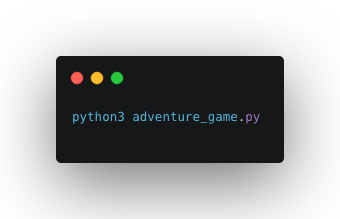

# The Adventure Game

`Run script in terminal`

The adventure game script is a fun game that takes you into a forest. Where you will be wondering around and giving into your curiosity. Where weapons lie hidden behind a rock and mysterious creature live in the depth of the forest. Come along in this adventure.

Through the build of this Adventure Game I grabbed on the concepts of recursion and how values are defined once passed as arguments. For instance some programming languages pass their arguments as values and others as reference. Python on the other hand passes them as Object Reference.

Coming from a JavaScript background _this_ threw a curve ball at me. If immutable arguments are passed to the function they will be passed as value. Other wise they will be passed as reference. Such as an array. If passed as an argument the user will be able to change its value. The passed by reference argument can be be reassigned locally, but outside the function scope it will have the same value.

There aren't any future plans for this project at the moment. So much for an adventure huh?
